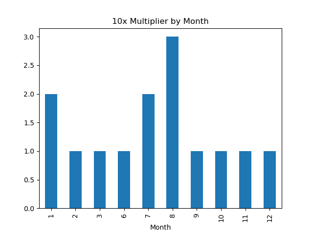
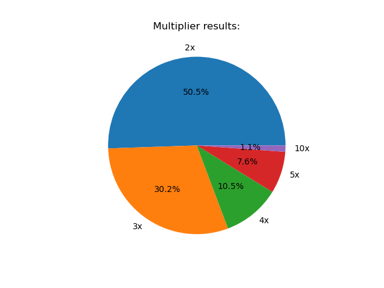
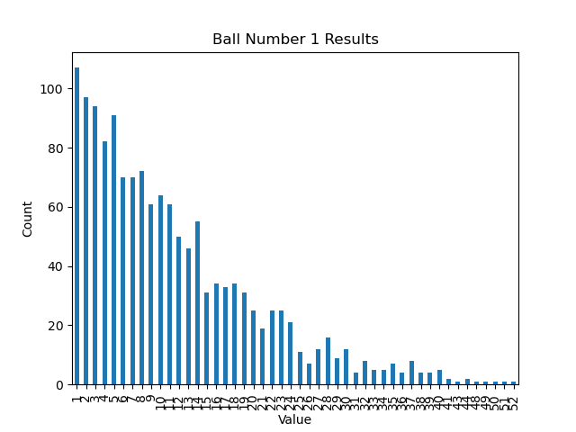

# This is a simple project to practice using pandas and matplotlib.
In this notebook, I used the winning PowerBall numbers to practice reading/editing a dataframe and making simple plots using matplotlib.
Some interesting insights I was able to gather:
- There has not been identical winning numbers.
- The most common multiplier is 2.
- The month with the most x10 multipliers is August with 3 out of 14.
  
Here are some examples of the plots I made:

  
