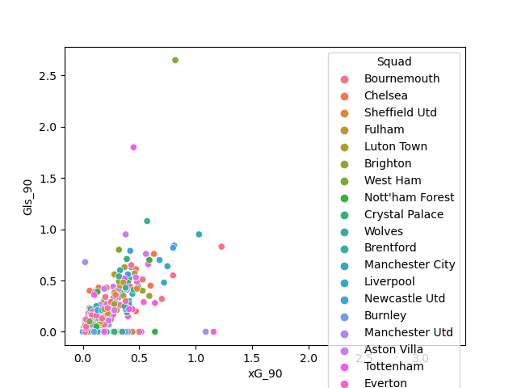
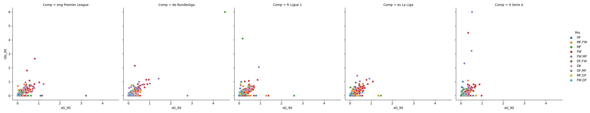

 # This is a project looking at player stats for the 2023-24 soccer Season in the top 5 leagues!
 
This project uses pandas, matplotlib and seaborn.

Some interesting insights I was able to gather:
- In the Premier League:
    - Only 9 players started each game.
        - 4 were Defenders
        - 5 were Goalkeepers

I was able to create these plots using seaborn:

