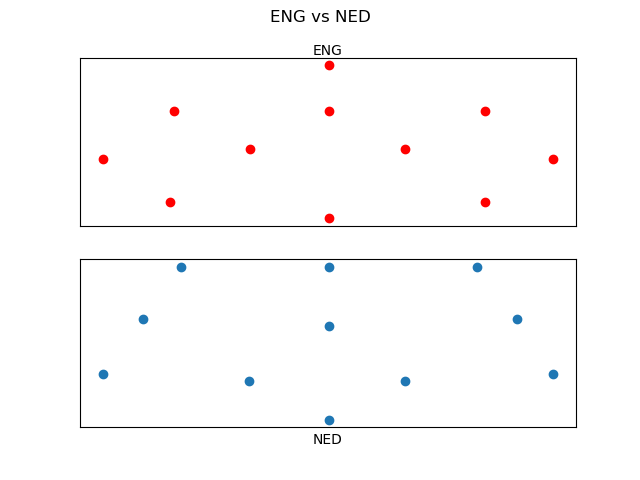
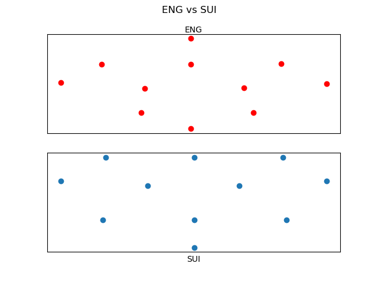

 # This is a project looking at European Football teams from 1960 - 2024
 
This project uses pandas, matplotlib, and numpy

In this notebook, I looked at the teams and players that have competed in the Euros.

Some interesting insights I was able to gather:
- players with the most starts:
    - Cristiano Ronaldo 28
    - Pepe 23
    - Manuel Neuer 20
- Austria as a team had the shortest average height

I was able to produce plots of the starting formations:

