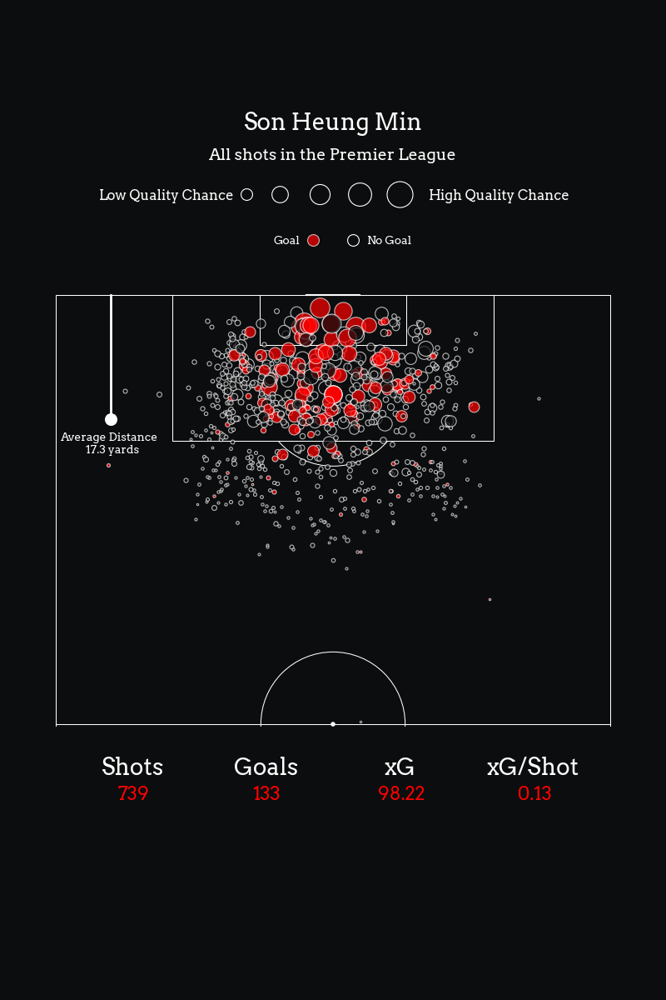

# Shot Heat Map

In this project I plotted players shots taken in the English Premier league. using data from understat.com

Here are examples of the figures I was able to generate:

You can run the python file shots2024.py to get figures of the current 2024 Premier League season.

Just enter a current players name When prompted!
Some examples:
- Erling Haaland
- Mohamed Salah
- Kai Havertz
- Son Heung-Min
